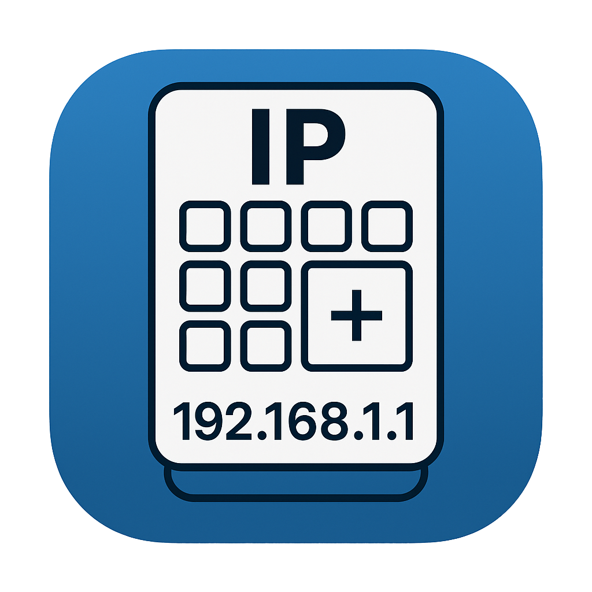

# NetBits

An IP address and subnet calculator for iOS.

<p align="center">
  
</p>

## Features

- Calculate from an IP address and subnet mask/prefix
- CIDR notation input in a single field (`192.168.1.10/24`)
- Binary representation of the address and mask
- Copy any result value with a long press
- Light and Dark mode
- Localization: English, Русский

## What it calculates

Netmask, wildcard, network and broadcast address, usable host range, host
count — plus the binary view of the address and mask.

## Requirements

- iOS 15.6+
- Xcode 16+

## Build

```bash
open IPCalculator.xcodeproj
```

or from the terminal:

```bash
xcodebuild -project IPCalculator.xcodeproj -scheme IPCalculator \
  -destination 'platform=iOS Simulator,name=iPhone 16' build
```

## Architecture

MVP: the `Presenter` owns business logic and screen state, the
`View`/`ViewController` only render, `Service`/`Formatter`/`Validator` handle
IP calculation and validation.

Branches: `feature/*` → `develop` (rebase, no merge commits) → `master` via
Pull Request.
